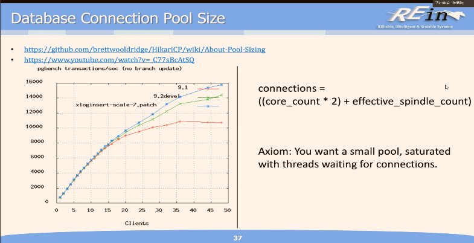

- 迭代三的笔记：

  - 当我们想要将对象模型映射到关系模型中存储时，常常会遇到以下问题：

    1.类与表的映射：对象模型中的类和关系模型中的表之间的映射并不直接。类通常具有继承关系、多对多关系等复杂结构，而表是扁平的结构，不容易直接表示类的结构。

    2.对象之间的关系：对象模型常常使用引用和关联来表示对象之间的关系，而关系模型使用外键等方式来表示关系。在映射到关系数据库时，我们需要将对象之间的关系转换为表之间的关系，这可能需要额外的设计和处理。

    3.数据查询：对象模型通常支持丰富的查询语言和操作，如面向对象查询语言（OQL）、图查询语言等，而关系数据库使用结构化查询语言（SQL）。在映射过程中，需要将对象模型中的查询转化为关系模型中的查询，可能需要进行适当的转换和调整。

  为了解决对象-关系阻抗失配问题，有一些解决方案和技术被提出，如对象关系映射（Object-Relational Mapping，ORM）框架。ORM 框架提供了一种将对象模型映射到关系模型的方式，并提供了简化数据访问和操作的接口。

  - DTO（Data Transfer Object）：
    数据传输对象，主要用于远程调用等需要大量传输对象的地方。比如我们一张表有 100 个字段，那么对应的 PO 就有 100 个属性。但是我们界面上只要显示 10 个字段，客户端用 WEB service 来获取数据，没有必要把整个 PO 对象传递到客户端，这时我们就可以用只有这 10 个属性的 DTO 来传递结果到客户端，这样也不会暴露服务端表结构.到达客户端以后，如果用这个对象来对应界面显示，那此时它的身份就转为 VO。在这里，我泛指用于展示层与服务层之间的数据传输对象。
  - 数据库解析 SQL 语句的过程可以简单描述为以下几个步骤：

    1.词法分析（Lexical Analysis）：数据库首先会将 SQL 语句进行词法分析，将其拆分成一个个的词法单元，例如关键字、标识符、运算符、常量等。这些词法单元将作为后续步骤的输入。

    2.语法分析（Syntax Analysis）：在语法分析阶段，数据库会根据 SQL 语法规则对词法单元进行分析和组合，构建语法树（Syntax Tree）或语法分析树（Parse Tree）。语法树表示了 SQL 语句的结构和层次关系。

    3.语义分析（Semantic Analysis）：语义分析阶段主要对 SQL 语句进行语义检查，确保其语义正确性。这包括检查表名、列名的存在性、数据类型的匹配性、约束条件等。

    4.查询优化（Query Optimization）：如果是查询语句，数据库会对其进行查询优化，以提高查询性能。优化器会根据统计信息、索引情况和查询的代价模型等因素，选择最优的查询执行计划。

    5.执行计划生成（Execution Plan Generation）：在执行计划生成阶段，数据库根据优化器选择的查询执行计划，生成具体的执行计划，即数据库引擎所需的操作序列。

    6.执行（Execution）：最后一步是执行生成的执行计划。数据库引擎会按照执行计划中的操作顺序，读取和操作存储在磁盘上的数据，并返回结果给用户。

  需要注意的是，不同的数据库管理系统（DBMS）可能在解析 SQL 语句的过程中略有差异，但大体流程是相似的。此外，数据库还会对 SQL 语句进行安全性检查，以防止 SQL 注入等安全问题。

  - 查询优化是通过数据库管理系统（DBMS）内置的查询优化器来实现的。查询优化器的主要目标是找到最优的执行计划，以尽可能地提高查询性能。下面是一些常见的查询优化技术：

  1. 查询重写：优化器可能会对输入的查询进行重写，以改变查询的结构或顺序，从而达到更高效的执行计划。例如，优化器可以将子查询转换为连接操作，或者重新排列连接操作的顺序。

  2. 索引选择：优化器会根据统计信息和查询条件选择合适的索引来加速数据检索。它会评估不同索引的代价，并选择对查询性能最有利的索引。

  3. 连接算法选择：对于涉及表连接的查询，优化器会选择合适的连接算法（如嵌套循环连接、哈希连接、排序-合并连接）来最小化连接操作的代价。

  4. 子查询优化：对于包含子查询的复杂查询，优化器会尝试将子查询改写为更高效的形式，或者选择合适的执行策略以减少子查询的执行开销。

  5. 表扫描优化：针对全表扫描的情况，优化器可能会考虑使用并行扫描或分区扫描等策略，以加速表的扫描过程。

  6. 统计信息利用：优化器会利用表的统计信息（如行数、数据分布等）来估算查询执行的代价，以便选择最优的执行计划。

  7. 缓存利用：对于重复执行的查询，优化器会尝试利用缓存中已经计算过的执行计划，以减少重复优化的开销。

  总之，查询优化器通过综合考虑查询的结构、访问路径、索引、统计信息等因素，尝试找到最优的执行计划，从而提高查询的执行效率。这些优化技术可以显著影响查询的性能，并在实际应用中发挥重要作用。

  - 5.21 的课开头讲了一些概念 第二节课讲了控制反转（依赖注入） 主要讲的是 springboot 如何通过注解进行组件的注入

    - 第一节课讲了第二次迭代的问题：

      - spring security 的逻辑需要看一看 说是 token
      - tomcat 使用用户名和密码向 mysql 建立 n 个连接 放入连接池（n 是 CPU 核数+硬盘数量）一个连接分时复用 供几千几万个用户使用 如果还是不够用 就增加数据库个数 每当用户需要使用一个连接 从连接池里拿取一个连接 用完后放回 连接池和线程池是一个道理 为了省去反复创建销毁对象的开销而预先分配好所有连接来使用（池化）
      - 一对多就是得存成两张表
      - Entity 是设计域的 DTO 是应用域对应需求的
      - 为什么要把 user 和 userauth 分成两张表：当发送对于用户某些信息的请求时 如果你只有 user 表 当你进行校验时不得不把密码也取出来 这是不安全的 如果用一张表 使用 DTO 可以解决这个问题
      - 另一个问题是 登录校验时 如果是根据 username 从数据库里取出 user 对象放到后端进行对比 同理不安全 理论上应该根据 username 和 pwd 在 user 表里查找 如果没找到就不会传输一个 user 对于我使用的 security 不知道是否有这个问题 需要研究一下
      - varchar 可变长 char 固定长 char 的 header 比较小 varchar 需要从后往前存 header 里得记录 offset char 访问速度快 varchar 可以压缩
      - 价格得使用整型 否则再小的误差也是致命的
      - 如何执行一条数据库语句：（可见上面）
        
      - driver 做什么事：把对应的语言写成数据库使用的语言 比如 jdbc 把 java 转换成 mysql 的 C 的 API
      - 数据库三部分：存储管理器（分散各个课） 查询处理组件（CSE） 事务管理组件（下学期的课）

    - 第二节课开始讲依赖注入（控制反转 IoC）：

      - 原本的代码编写流程是 手动实例化一个对象（比如 new 一个） 然后调用这些对象进行操作 如果需要更改某一个对象 就得去修改所有相关的代码
      - 控制反转做的事情就是 把主动实例化变为被动实例化 把这个实例化依赖类的工作交给框架来自动实现 因此我们只需要把依赖类进行注入框架 而框架是个好东西 因为可以无限复用 依赖注入 DI 是控制反转的一种实现方式 即在运行时才把依赖类注入进代码框架里
      - 注入有很多种方式 包括注解注入等 第三方（如 springboot）可以读取注解（告诉第三方这个类要被托管）来获取配置信息 然后把实例注入给代码 框架去扫描哪个组件是被注入的
      - 接口和实现分离好处之一：你可能会用到一个测试用的实现类 另一个则是部署后的运行类 不分离你就需要写两个类 而且还是得修改代码内部的依赖类 分离后就可以只通过改注解来告诉框架该使用哪个类了
      - spring 的 ioc 容器称为 bean @componentscan 会对所有 component 进行扫描并注册对应的 bean @configration 标明这是一个配置类 在这个类里用@bean 标注的方法变量等会被托管 并且在运行时提供给需要注入这些类的地方 @repository 等注解 本质上都是@component 没有什么本质区别 命名约定俗成
      - 使用配置文件 xml 进行注入 1 使用类型匹配 2 使用位置匹配 3 使用名字匹配 不需要重新编译 而且最后发布只会给外界 class 文件 配置文件给用户进行修改就行 即环境变量
      - 后端结构至少要有如图
        
      - 接口应该不用标注解 实现类标注解来声明这个类是需要托管的 在类里使用 autowired 来注入一个对应接口的实例化的类 比如 repository 实际上我们只写了接口 是 jpa 自动帮我们根据函数名字生成的实例类 service 则是在实现类上注解 于是注入了这个实现类
      - 为什么接口和实现需要分离：
        首先不希望接口实现绑定 比如你需要写一个更好的 service 类 如果绑定了 你就需要去 controller 层里修改这个 service 类的对象 如果分离了 就可以不动 只需要删除旧的实现类 新的实现类上注解上@service springboot 就会根据接口扫描这个类并注入
        接口是依赖的基础 声明接口就可以自动注入实现 接口是编程的契约 规范了实现类的编写 java 的 interface 就是所有方法都是抽象的抽象类
      - IoC 就在做接口和实现分离 是我们代码分层架构的基础
      - @transient 注解标明这个类不应该被 jpa 托管（比如 MongoDB 数据库里的数据）
      - DAO 层示例代码：（详见 23PPT 最后几页 以后部署 MongoDB 可以照着写）
        
        

  - 5.28 的课 （join、view、transaction、LOB

    - （数据库内的）外键影响性能 主要是因为增删改查的级联操作 如果不做外键关联 只在 jpa 里做级联操作 是不符合规范的 数据库必须要有外键的约束 因为如果有其他的应用访问你的数据库 它没有做规范 就失去了一致性 如果保证了只有此应用进行数据库的访问 并且实在需要高性能 可以考虑不用外键约束而只进行级联操作而保持一致性（比如游戏）并且需要保持只有这一个应用使用数据库

    - join 操作：

      - select from 操作是拿两张表做笛卡尔积形成 m\*n 条记录 筛选符合 where 的行 id 列（即 where 要求相同的列）会出现两次（两个表的 id） join 则只有一列 通过这一列来拼接
      - natural join：（这一部分有点不明）
        自然连接可能会让两张表中具有相同名称的字段给消除掉（或者是保留两列？） 造成歧义（比如学生的专业和课程的专业）解决方法是使用 using 子句 即指定使用哪一个列进行连接
      - outer join：（尽可能保留全的记录）
        left outer join 操作 会保留左表的所有记录 如果右表没有对应的记录 就置为 null fullouter 就是左右都保留
      - 内连接（默认行为）：只保留左右有对应记录的记录
      - on 和 using：on 连接谓词 using 连接一个字段 using 只能在连接相同名字的列时使用

    - view（视图）：

      - 即希望不同的人看到不同的数据库关系 MySQL 中的视图（view）是一种虚拟表，其内容由查询定义，是一个逻辑表，本身并不包含数据 应该存放在内存里（否则占用空间 而且一致性差）
      - view 表存储的是 sql 语句 当需要用到这个 view 时 动态执行（替换）这个表达式逻辑来形成一张结果虚拟表
        示例：
      - view 可以嵌套另外一个 view 也可能会造成递归 会嵌套替换到没有 view 为止
        示例：
      - materialized view（物化视图）：如果一个 view 不太可能需要变化 可以建立物化视图 在数据库的引擎里管理生命周期 不是应用级的 可以提高性能 需要占用物理空间 一般是预先存储操作频繁的查询结果 方便减少开销 但是要进行动态维护
      - view 表也可以进行 update 如果是复杂的查询得到的 view（比如笛卡尔积）不建议直接操作 而是在原表进行操作
      - view 的逻辑尽量简单 才可以匹配尽可能多的查询操作

    - transaction（事务）：

      - 又称工作单元 保持操作的原子性（比如转账 先减后加）和隔离性（两个用户并发写操作的问题） 事务操作的结尾一定是完整的提交操作或者回滚所有操作

    - integrity constraint（限制一致性）：

      - not null
      - primary key
      - unique
      - check（P）：自定义谓词 单个表
      - foreign key：1 不要外键 换得高性能 2 要用外键 保持一致性 3 没有外键 但是在应用级进行一致性的检查 必须保证只有你自己的应用访问数据库
      - cascade
      - assertion：多个表的约束

    - 一些特殊数据类型：

      - 时间类型 有规范
      - LO（大对象类型）：存的是个指针 指向了硬盘上的地址 blob 是二进制类型数据 clob 是文本类型数据 图片并不用存储到 MongoDB 在 mysql 里也是存指针 MongoDB 适合存的是类似于评论的树状结构数据（结构化不好的数据 关系型里就得存储父子关系 比如评论回复关系）非关系型数据库存储的是文档 类似于 json 的格式存储

  - 5.30

        - 先讲了分页：repository 要扩展 pagingandsorting（jpa 不行吗？）

        - index 索引：

          - 为什么不用二叉树用 b 树：层数太高 效率太低
          - 只在某些字段上建索引：要求取值比较多 且不能大量为空 并且数据量大一点才需要 因为 b 树一层可能就有几百叉 维护索引时的插入会涉及分裂和合并操作 开销很大
          - 主键索引是很合适的 不过如果不经常使用主键进行查询 那就没意义

        - 数据库范式

          - 冗余数据：性能和一致性的取舍 冗余越多 范式性越差 比如书的评分 实际上是可以用 ratings 表算出来的 但是为了方便 不能每次都 join 但是就需要多维护数据一致性 范式就是在解决冗余的问题
          - 第一范式：（不能有重复）所有字段的值具有原子性 不氪分割
          - 第二范式：（非主键不能依赖于非主键）非主键字段必须完整依赖主键字段 数据表的记录可唯一标识

            - 有损分解：如果数据表的分解因为某些字段的重复而导致记录变少了或者变多了

          - 第三范式：（非主键不能部分依赖于主键 即不能有非主键依赖于非主键）所有非主键字段必须与主键字段直接相关 不能与其他非主键字段存在依赖关系
            或者是 BC范式的情况以外 B-A的所有属性都是某一个候选键里的

            - 函数依赖：说属性A依赖于属性B（B决定A） 即确定了记录的属性A后就可以确定记录的属性B 换言之 属性A到属性B有函数映射
            - 超键：能够唯一标识记录的属性集（即包含了主键的任意属性集） 定义上讲 元组R依赖于超键K
            - 候选键：最小的超键（即没有超键子集）
            - 主键：从候选键中选取一个作为标识的键
            - 无损分解：如果分解后的两张表的共同键可以决定两表之一 则为无损分解 三范式和BC范式都要求无损分解
            - 依赖保留：如果依赖关系可以在一张表内就能确定 尽量不要在两张表（必要时可以舍弃）

          - BC 范式：（所有非主键不能传递依赖于主键）对于任何的属性依赖A->B 若A不包含B 则要求A包含候选键
            - 如何分解：分为两张表 一张是A B的并集 另一张是所有的属性除去（B-A）
            - BC范式优先于依赖保留 而三范式一定可以做到依赖保留

          - 第四范式：多值依赖

          - canonical cover（规范覆盖）：最小最简洁的关系模式 只需要验证这个规范覆盖即可以验证所有依赖关系 通过不断去掉冗余的关系可以得到规范覆盖

          - 迭代分解主要步骤就是选出不符合范式的A->B 然后把AB拉出来形成

  - JPA/ORM：
    - ORM：对象模型映射到关系模型 基本原则就是一张表就是一个类 对象和关系存在失衡现象 粒度也有可能不同 - 继承关系如何映射：比如 User 类被普通用户和管理员类所继承，这在关系型数据库中主要有三种解决方式，分别是单表继承、具体表继承以及类表继承。在我的 User 类，是用单表继承实现的，也就是把所有普通用户和管理员都放在一张表里，用 role 字段来区分是哪种子类。我选用这样的方式是基于管理员和普通用户的属性全部一致的特性，也就是说管理员在字段上没有和普通用户有任何差别（都有用户名密码头像简介，甚至都可以买书下订单，而且管理员相对来说只有一个或几个，基本上都是普通用户）。当然，这样的设计是比较浪费空间的，如果两个子类的差别较大或者有更多种子类，显然这样的设计是不合理的。比如我在另外一门课上设计 Comment 类，有三种子类（动态评论、专家评论、文章评论），我采用了类表继承的方式，Comments 表只放 id，三种子类表分别放具体的属性（内容，时间等等）。这样的设计方便扩展继承，节省空间，关系也更加清晰，适用于复杂的继承关系。1 joined table：三张表 user 普通用户 管理员 查询时进行 join 优点是修改最小 2 table per class：三个表 每个表都存一个类的完整信息 查询容易修改难 维护一致性复杂 3 单表：全部放在一张表里 但是会浪费空间 有很多 null 约束没法保证 而且难扩展
    - ORM 想解耦：表名和类名可以解耦 字段和属性名可以不一样 关系方向可以不一样（多对一在数据库里是多方持有外键 但是对象关系可以是双边的） 表和类的数量可以不一样（多对多会拆出表 而且有些简单字段表不需要设计对应的类 比如 email）复杂化的设计降低了性能 但是带来了数据库和后端的解耦
    - A.详细阐述在 JPA 中，对象与关系型表之间解耦的方式，例如，实体类的名称与表的名称可以不一样（1 分）
      答：
      JPA 有很多实现解耦的方式，我在这里我认为比较常见的几个。 1.使用@Entity 注解建立实体类和表的映射关系。通过这个注解，我们可以让一个实体对应一张数据表，并且把各个属性对应各个字段，还可以用一对多注解映射外键关联。至于题目中提到的如何实现实体类和表的名称不一样，可以通过在注解参数里注明数据表名称、字段名称等。再比如实体的字段映射的数据类型，也可以通过这种方式注明。 2.编写 application.yml 文件。JPA 支持编写配置文件来把一些配置属性注入到类里，比如可以设置静态资源路径，而不是在 controller 类里手动修改。还有最基本的 datasource 等配置。 3.通过注解进行分层，实现控制层业务层数据访问层和实体层的解耦，一层一层的注入，实现了解耦。
      B.详细阐述在你的 JPA 映射方案中，存在哪些对象模型与关系模型不一致的地方，以及给出合理的设计理由（1 分）
      答： 1.对象模型的继承和多态是关系模型所不直接支持的。比如 User 类被普通用户和管理员类所继承，这在关系型数据库中主要有三种解决方式，分别是单表继承、具体表继承以及类表继承。在我的 User 类，是用单表继承实现的，也就是把所有普通用户和管理员都放在一张表里，用 role 字段来区分是哪种子类。我选用这样的方式是基于管理员和普通用户的属性全部一致的特性，也就是说管理员在字段上没有和普通用户有任何差别（都有用户名密码头像简介，甚至都可以买书下订单，而且管理员相对来说只有一个或几个，基本上都是普通用户）。当然，这样的设计是比较浪费空间的，如果两个子类的差别较大或者有更多种子类，显然这样的设计是不合理的。比如我在另外一门课上设计 Comment 类，有三种子类（动态评论、专家评论、文章评论），我采用了类表继承的方式，Comments 表只放 id，三种子类表分别放具体的属性（内容，时间等等）。这样的设计方便扩展继承，节省空间，关系也更加清晰，适用于复杂的继承关系。 2.对象模型中的聚合和组合关系是关系型数据库不直接支持的，JPA 采用了一对多、多对多等关系进行处理，具体而言我拿购物车项和用户的关系举个例子。用户和购物车项是一对多的关系，在对象模型中表示为用户有一个对象数组属性。在关系型数据库中，常用外键关联来表示这种关系。因此在我的设计里，购物车项具有多对一注解的属性 User，外键则是 uid；用户则具有一对多注解的属性 Cartitems，这样就建立了两种实体类在关系型数据库中的关联。多对多关系则复杂一点，以 Book 类和 Tag 类举例，JPA 的多对多注解会生成一张关联表，相当于把多对多关系拆解成了两个一对多关系，然后再用外键进行关联。这直观的表现为，一本书和一个标签的关系会在 book_tag 表里作为一条记录，代表这本书具有这个标签。我的设计中也是这样的，详情见后端代码。 3.对象模型的查询和关系数据库的查询是不直接匹配的，因此 JPA 采用了命名生成函数以及自定义 JPQL 语句来支持对象的查询。在我的设计里基本上都通过命名生成的函数来实现了增删改查的操作。

- 迭代问题：

  - 你是如何确保用户密码安全的？

    - 使用加密哈希存储于数据库 防止泄露
    - security 使用的校验方式是根据用户名从数据库中获取存储的密码，然后使用这个密码来验证用户输入的密码 如果希望像 chp 上课讲的一样后端把数据传输给数据库进行校验 那就不能存哈希值 只能明文存储了
    - 所以是两种方法任选其一 我在后端都实现了
    - 加密哈希可以保证即使有人知道了哈希值也无法知道密码 但是其他用户信息会在后端和数据库之间传输
    - 明文存储并在数据库里校验可以保证所有用户信息不会被动传输到后端 但是一旦泄露就寄
    - 如果使用产生唯一值的哈希（折中实现） 会有个问题 比如我的密码和另外一个人一样 那么一旦我知道我们的哈希值一样 就等于我知道了他的密码

  - 你认为你现在实现的登录功能有什么安全风险？如何应对？

    - http 是明文传输易窃听 并且不验证双方身份 也无法验证报文内容是否遭到篡改 存在安全问题 可以通过获取 ssl 证书并使用 https 协议进行传输
    - CSRF 攻击诱导用户进行操作 可以通过最简单的设置登录验证码解决 也可以使用 同源检测 token（原理需看一眼）
    - security 实现的登录逻辑需要在数据库和后端之间进行密码的传输 这是不安全的 理论上要把密码和用户名原封不动传输给数据库 而不是根据用户名找用户进行校验

  - 为什么需要分为 CSDE 四个层？

    - 软件设计的原则是高内聚低耦合 分层架构可以让各个层次的代码专注于自己部分的功能 这是高内聚 可以降低层与层之间的联系 通过接口来交互 实现依赖注入 使得互相不用知道依赖的细节 这是低耦合 如此在维护代码时就可以尽可能的少变动 只需要改动对应层次功能的部分 并且分层还有个好处是可以做到高复用 高扩展性

  - 为什么需要接口实现分离？

    - 概括性的讲 还是为了解耦高聚合可扩展
    - 举个例子 我可能会用到一个测试用的实现类 另一个则是部署后的运行类 不分离你就需要写两个类 而且还是得修改代码内部的依赖类 分离后就可以只通过改注解来告诉框架该使用哪个类了
    - 为什么接口和实现需要分离：
      首先不希望接口实现绑定 比如你需要写一个更好的 service 类 如果绑定了 你就需要去 controller 层里修改这个 service 类的对象 如果分离了 就可以不动 只需要删除旧的实现类 新的实现类上注解上@service springboot 就会根据接口扫描这个类并注入
      接口是依赖的基础 声明接口就可以自动注入实现 接口是编程的契约 规范了实现类的编写 java 的 interface 就是所有方法都是抽象的抽象类
    - IoC 就在做接口和实现分离 是我们代码分层架构的基础

  - spring 依赖注入是？有什么好处？

    - 依赖注入是实现控制反转的一种方式 那么控制反转是什么呢？
    - 原本的代码编写流程是 手动实例化一个对象（比如 new 一个） 然后调用这些对象进行操作 如果需要更改某一个对象 就得去修改所有相关的代码
    - 控制反转做的事情就是 把主动实例化变为被动实例化 把这个实例化依赖类的工作交给框架来自动实现 因此我们只需要把依赖类进行注入框架 而框架是个好东西 因为可以无限复用 依赖注入（DI）是控制反转的一种实现方式 即在运行时才把依赖类注入进代码框架里
    - 注入有很多种方式 包括注解注入 构造函数注入等 第三方（如 springboot）可以读取注解（告诉第三方这个类要被托管）来获取配置信息 然后把实例注入给代码 框架去扫描哪个组件是被注入的
    - 好处同上例 解耦方便进行改动 方便进行测试（因为测试单元可以注入）

  - 你的实体类 ID 是如何生成的？

    - 使用 jpa 提供的注解@GeneratedValue 配置的 type 是 identity 也就是由数据库自动生成（数据库里配置的都是自动增长）

  - 哪些实体类之间设置了 cascade？各个实体之间的 cascade 是如何实现的？

    - 在所有的一对多关系里都设置了级联（ALL=PERSIST+MERGE+REMOVE+REFRESH） 具体而言是一方设置了所有操作对于多方要级联 比如 order 和 orderitem 如果对于某一个 order 进行删除 对应的 orderitem 也要删除 如果插入一个 order 实体 显然其 orderitem 数组也要被插入 orderitem 表里 如果更新一个 order orderitem 的 order 属性也会更新
    - 是通过注解实现的 onetomany 等 在 jpa 中 在注解上写上 cascade 即可 写上 cascade 的这一方会成为主动方

  - 关于 ORM 的问题

  - 你的数据库表设计考虑了哪些函数依赖？

    - 以 cartitem 为例 book 依赖于 bid bid 依赖于 cartitem 表的 id 所以需要把 bid 保留 把 book 属性拆开
    - 以 books 表为例 候选键有 isbn title 和 id 主键是 id 所有属性其实都完全依赖于候选键
    - 最终的设计中所有非主键都完全依赖于主键（id）

  - 你的数据库表设计是否实现了无损分解？

    - 是的 比如 books 表和 cartitems 表 共同属性是书的 id 在 books 表里作为主键决定其他所有属性 则是无损分解

  - 遵循了什么样的范式？

    - 都遵循 BC 范式 比如 books 表 非主键属性 author 依赖于 title 但是 title 是一个候选键 isbn 同理 users 表的非主键 username 同理也是候选键
    - 易得肯定也遵循三范式 比如 cartitems 表 所有属性都依赖于 id 不存在冗余信息（比如 user 的信息）依赖非主键（比如 uid）

  - 关于数据库设计的问题

- 最终需要做的：
  - 把所有接口和实现分离（service 肯定要 controller 不用 dao 也要）
  - 改变拦截逻辑（分个分支改吧 方便以后改回来）
